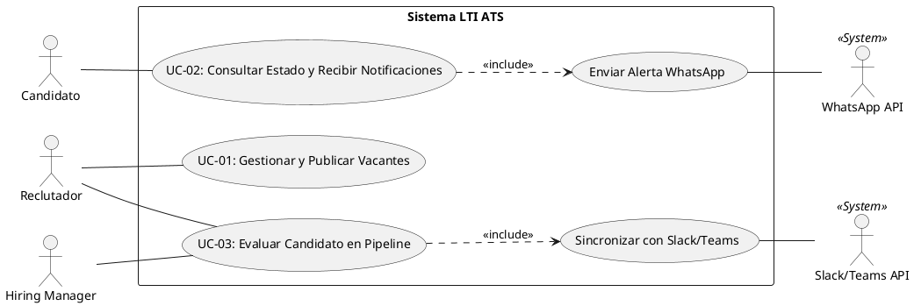
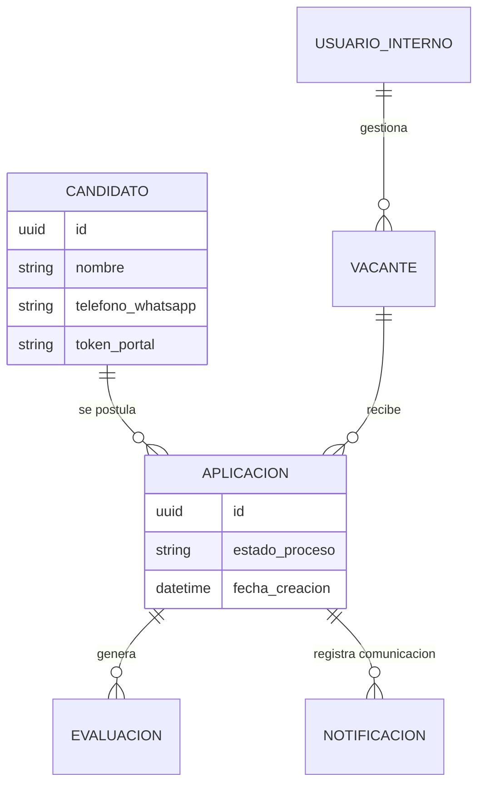
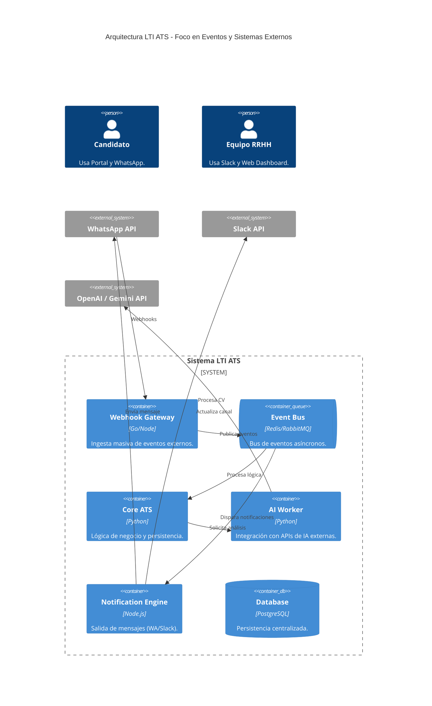

# LTI - Ecosistema de Reclutamiento Inteligente 🚀

**LTI** es un sistema de seguimiento de candidatos (ATS) de nueva generación diseñado para eliminar el "agujero negro" de las aplicaciones laborales. A diferencia de los sistemas tradicionales que actúan como bases de datos pasivas, LTI es una plataforma bidireccional que prioriza la experiencia del candidato y la agilidad operativa de las startups y scaleups.

---

## 🌟 Valor Añadido y Ventajas Competitivas

* **Transparencia Radical:** El candidato tiene el control total de su proceso a través de un portal de autoservicio con actualizaciones en tiempo real.
* **Fricción Cero:** Integración profunda con **WhatsApp** para comunicaciones críticas y recordatorios, eliminando la dependencia de correos electrónicos.
* **Ecosistema Conectado:** Flujo de trabajo integrado de forma nativa en **Slack y Microsoft Teams**, permitiendo decisiones rápidas sin salir de la herramienta de comunicación.

---

## 🛠 Funcionalidades Principales

1.  **Candidate Experience Portal (CEP):** Panel personalizado para aspirantes con visualización de etapas y perfiles de entrevistadores.
2.  **WhatsApp Sync & Automation:** Bot para envío de resúmenes, confirmación de asistencia y reprogramación automática.
3.  **Collaborative Pipeline (Slack/Teams Native):** Notificaciones inteligentes con botones de acción (Aprobar/Rechazar) en canales internos.
4.  **Smart Sourcing & Parsing:** Motor de IA para extracción automática de datos de CVs y pre-clasificación inteligente.
5.  **Unified Calendar & Interview Suite:** Sincronización de agendas y generación automática de enlaces para reuniones virtuales.

---

## 📈 Modelo de Negocio (Lean Canvas)

```mermaid
block-beta
  columns 5

  block:problem:1
    p1["**1. PROBLEMA**"]
    p2["- Abandono candidatos\n- Procesos lentos\n- Dispersión (Email/Slack)"]
  end

  block:sol_met:1
    block:sol:1
      s1["**4. SOLUCIÓN**"]
      s2["- Portal tiempo real\n- WhatsApp Sync\n- Integración Slack"]
    end
    block:met:1
      m1["**8. MÉTRICAS**"]
      m2["- Candidate NPS\n- Time-to-hire"]
    end
  end

  block:uvp_block:1
    u1["**3. PROPUESTA VALOR**"]
    u2["**'El ATS que aman y usan'**\n\nReclutamiento transparente\ny ágil en un solo lugar."]
  end

  block:adv_cha:1
    block:adv:1
      a1["**9. VENTAJA**"]
      a2["WhatsApp + Portal\n(First-mover)"]
    end
    block:cha:1
      c1["**5. CANALES**"]
      c2["- Slack Directory\n- LinkedIn Ads"]
    end
  end

  block:segments:1
    seg1["**2. SEGMENTOS**"]
    seg2["**Startups/Scaleups**\n(20-500 emp)\n\n*Early Adopters:* Founders\ny HR Leads Tech."]
  end

  block:costs:2
    cost1["**7. ESTRUCTURA DE COSTOS**"]
    cost2["Cloud/Devs | Marketing | APIs WhatsApp"]
  end

  block:revenue:3
    rev1["**6. FLUJOS DE INGRESO**"]
    rev2["Suscripción SaaS (vacante/user) | Add-ons Integraciones"]
  end

  style p1 fill:#f9f,stroke:#333
  style s1 fill:#bbf,stroke:#333
  style m1 fill:#bbf,stroke:#333
  style u1 fill:#dfd,stroke:#333
  style seg1 fill:#fdb,stroke:#333
  style cost1 fill:#eee,stroke:#333
  style rev1 fill:#eee,stroke:#333
```

---

## 📋 Casos de Uso Principales

| ID | Caso de Uso | Actor | Descripción |
| :--- | :--- | :--- | :--- |
| **UC-01** | Gestión de Vacantes | Reclutador | Creación de vacante y publicación automatizada. |
| **UC-02** | Seguimiento de Candidatura | Candidato | Consulta de estado y alertas vía WhatsApp. |
| **UC-03** | Evaluación Colaborativa | Hiring Manager | Feedback y toma de decisión desde Slack/Teams. |

### Diagrama de Casos de Uso (UML)

---

## 💾 Modelo de Datos

### Entidades y Relaciones
* **Candidato:** `id`, `nombre`, `telefono_whatsapp`, `token_portal`.
* **Vacante:** `id`, `titulo`, `estado`, `id_hiring_manager`.
* **Aplicación:** `id`, `id_candidato`, `id_vacante`, `estado_proceso`.
* **Evaluación:** `id`, `id_aplicacion`, `calificacion`, `slack_thread_id`.

---

## 🏗 Arquitectura del Sistema (EDA)

LTI utiliza una **Arquitectura Orientada a Eventos (EDA)** con microservicios desacoplados para garantizar escalabilidad y eficiencia en la ingesta de webhooks masivos.

### Diagrama C4 (Contenedores e Integraciones)

---
*Documento de arquitectura y producto para LTI - 2026.*